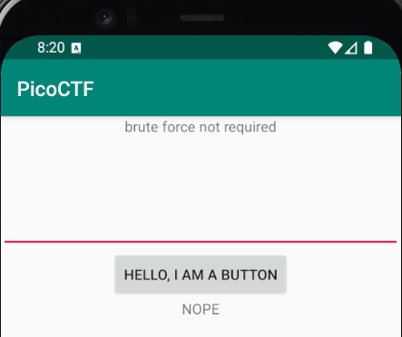
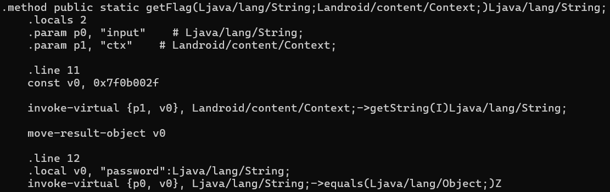

# droids1 - PicoCTF 2019

**Category**: Reverse Engineering

**Difficulty**: Hard

**Tags**: `picoctf` `reverse-engineering` `android` `apk` `apktool` `mobile-security`



*Most Android reversing writeups jump straight to decompiling DEX or analyzing native libraries. This challenge teaches you something more fundamental: sometimes the answer is just sitting in the resources folder.*

## Challenge Description

> Where do droid logs go?

**Given files**: `one.apk`

## Initial Reconnaissance

First things first: we need an environment to actually run this APK. Android Studio provides everything needed—emulator, ADB tooling, and SDK platform tools.

After spinning up a Pixel 4 emulator with Android 10 or higher, verify connectivity (from C:\Users\<user>\AppData\Local\Android\Sdk\platform-tools) using Windows Command Prompt:

```bash
adb devices
```

Install the APK:

```bash
adb install one.apk
```

The app installs successfully. Launch it using the monkey tool:

```bash
adb shell monkey -p com.hellocmu.picoctf -c android.intent.category.LAUNCHER 1
```

This opens the app in the emulator. We'll need the package name later to extract the installed APK properly.

```bash
adb shell pm list packages -3
```


Output shows: `package:com.hellocmu.picoctf`

## Approach

### Step 1: Extract the Installed APK

APKs get renamed when installed on Android. To pull the actual installed version:

```bash
adb shell pm path com.hellocmu.picoctf
adb pull /data/app/~~randomstring~~/com.hellocmu.picoctf-randomstring/base.apk picoctf.apk
```

Now we have a local copy to tear apart.

### Step 2: Decode with apktool

Decompilers like JADX are useful, but `apktool` gives us something better: readable smali code *and* all the app resources in their original structure.

```bash
apktool d picoctf.apk -o decoded
```


This extracts:
- `smali/` - Dalvik bytecode in human-readable format
- `res/` - All resources (layouts, strings, drawables)
- `AndroidManifest.xml` - App configuration

### Step 3: Find the Password Logic

Opening `decoded/smali/com/hellocmu/picoctf/MainActivity.smali`, the button click handler shows:

```smali
invoke-static {v0, p0}, Lcom/hellocmu/picoctf/FlagstaffHill;->getFlag(Ljava/lang/String;Landroid/content/Context;)Ljava/lang/String;
```

The user input gets passed to `FlagstaffHill.getFlag()`. Let's check that class.

In `FlagstaffHill.smali`, the validation logic is straightforward:



```smali
const v1, 0x7f0f002f    # R.string.password

invoke-virtual {p1, v1}, Landroid/content/Context;->getString(I)Ljava/lang/String;

invoke-virtual {p0, v0}, Ljava/lang/String;->equals(Ljava/lang/Object;)Z
```

Translation: 
1. Load string resource `R.string.password`
2. Compare user input with that string
3. If match, call native function `fenugreek()`
4. If no match, return "NOPE"

The password isn't computed or obfuscated, it's a static resource.

### Step 4: Resolve the Resource

From `R$string.smali`:

```smali
.field public static final password:I = 0x7f0f002f
```

That's just the resource ID. The actual value lives in `res/values/strings.xml`:


```xml
<string name="password">opossum</string>
```

There it is.

## Solution

Run the app in the emulator and enter the password:

```
opossum
```


The native `fenugreek()` function executes and displays the flag.

<details>
<summary><b>Flag</b> (click to reveal)</summary>

`picoCTF{pining.for.the.fjords}`

</details>

## Tools Used

- **Android Studio** - Emulator and development environment
- **ADB (Android Debug Bridge)** - APK installation and extraction
- **apktool** - APK decoding to smali and resources

## Lessons Learned

- Android string resources are easy targets for reversing—always check `res/values/strings.xml` before diving into smali or native code
- `apktool` preserves the original resource structure better than pure decompilers
- Understanding Android's resource resolution system (`R.string.*`, resource IDs) saves time
- Native JNI functions aren't always the challenge—sometimes they only execute after you've already solved the real puzzle

The challenge name "droids1" and the question "Where do droid logs go?" was a hint toward Android resources and logging mechanisms, though the solution was simpler than expected.

## References

- [apktool - A tool for reverse engineering Android APK files](https://apktool.org/)
- [Android Debug Bridge (adb) Documentation](https://developer.android.com/tools/adb)
- [Smali/Baksmali Documentation](https://github.com/JesusFreke/smali)

---

**Also published on**: [Medium](https://medium.com/@Aeronique) | [aerobytes.io](https://aerobytes.io/writeups/)
